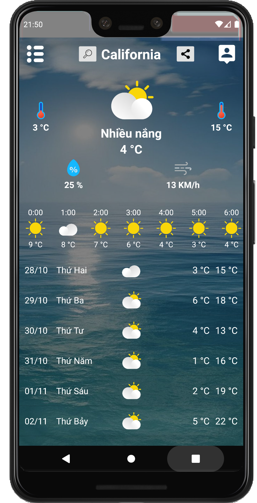

# Weather application

Simple weather application

## Features 
* Weather information
* Search by location, city
* Share weather information

## Source of information 
* [World weather online](https://www.worldweatheronline.com/)

## Libraries 
* [Picasso](https://github.com/square/picasso)

## Screen Shot

## Support
* Android 5.0 +

## Development team
* [Phuc Tran Ba](https://github.com/phuctranba)

## Development purpose
Personal projects
